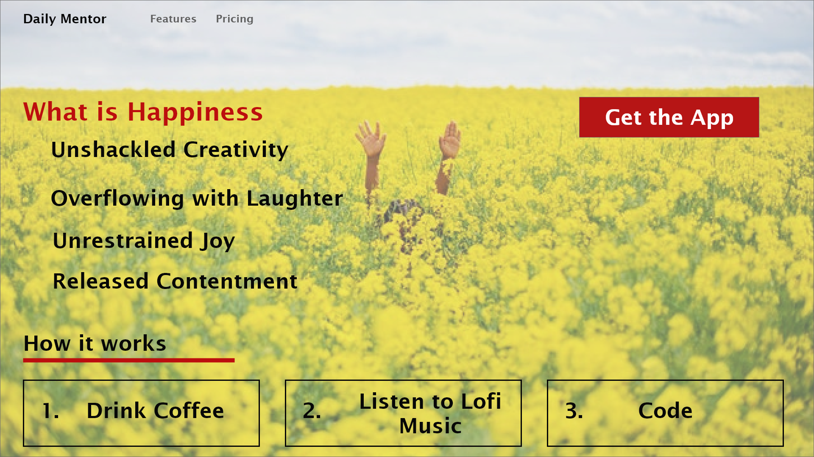

# Sunflower Happiness

### Table of Contents

1. Purpose
2. Motivation
3. Wireframe
4. Technologies Used

### Purpose:

The goal was to practice styling with CSSGrid, using BEM practices, and practing designing landing pages. 

### Motivation:

I am happy and wanted to express it.

### WireFrame

### This app was built with the following technologies:

**React:** JavaScript front-end library for building user interfaces

**Abode XD** A wire-framing tool used to create a mockup/visual of what is to be coded

**Git-Hub:** Web-based version control repository and Internet hosting service

**JavaScript:** Object-oriented programming language for web pages

**HTML:** Mark-up language for creating web pages

**CSS:** A formatting language for styling web pages

_Created by JC Smiley in February of 2021_
